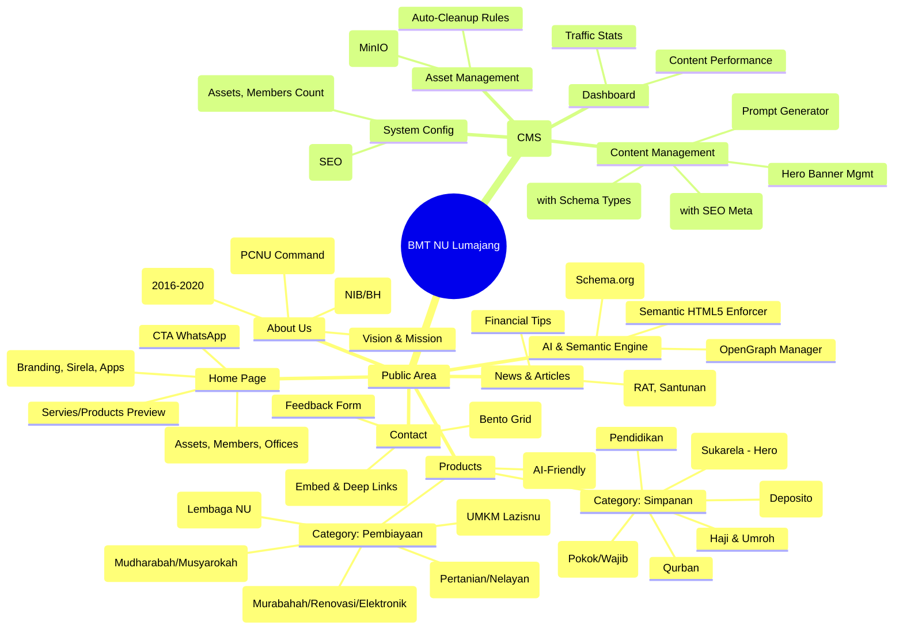
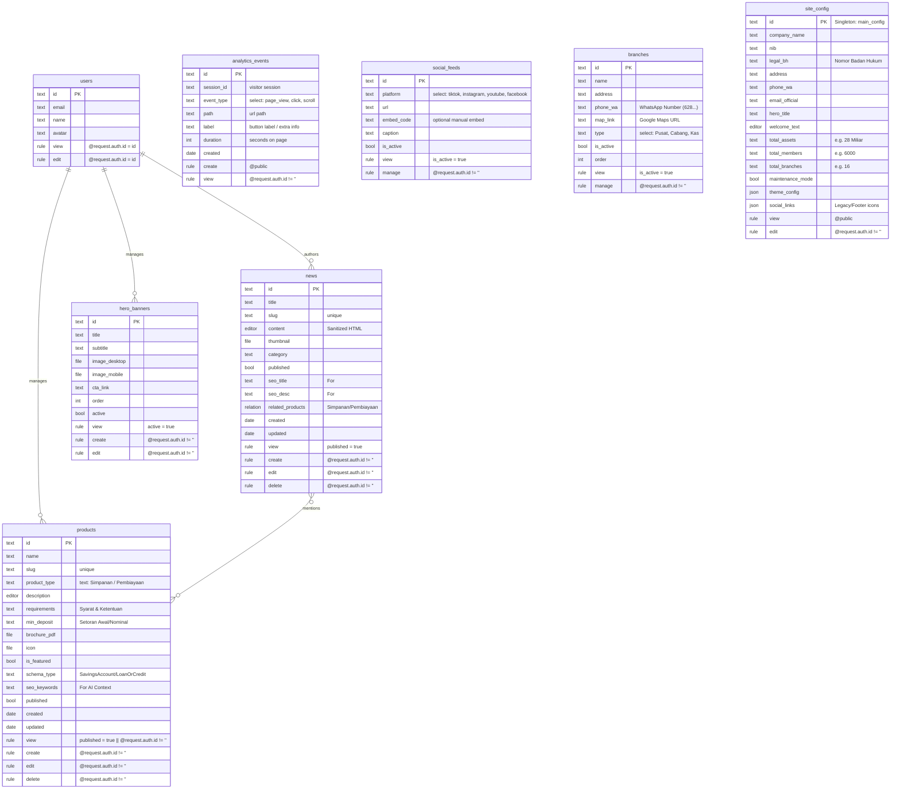

# BMT NU Lumajang - Architecture & Blueprint

**Phase 1: Architecture Design**

This document outlines the technical and security architecture for the BMT NU Lumajang platform (Next.js + PocketBase/MinIO).

## 1. Architectural Diagrams

### A. Feature Map (Mindmap)

Breakdown of Public vs. Admin features, including the **AI & Semantic Engine**.

### B. App User Flow (Flowchart)

User journeys for Public Visitors and Admins.

### C. Advanced ERD (PocketBase Schema)

Entity Relationship Diagram with Security Rules annotated. **Updated for AI-SEO.**

### 2. Project Structure (Next.js 14)

d:/web-bmtnulumajang/
├── app/
│   ├── (root)                 # [Public Domain] <www.bmtnulmj.com>
│   │   ├── page.tsx           # Landing Page (Root)
│   │   ├── berita/            # News
│   │   ├── produk/            # Products
│   │   └── kontak/            # Contact
│   │   └── tentang-kami/      # About Us
│   ├── panel/                 # [Admin Subdomain] <cp.bmtnulmj.com> / admin routes
│   │   ├── page.tsx           # Redirect -> Login
│   │   ├── login/page.tsx
│   │   └── dashboard/
│   │       ├── layout.tsx     # Admin Sidebar/Shell
│   │       └── ...
│   │       └── ...
│   ├── api/                   # Route Handlers
│   │   └── cdn/secure/        # Secure CDN Proxy (masks PocketBase URL)
│   ├── layout.tsx             # Root Layout (Providers)
│   └── globals.css            # Tailwind + CSS Variables
├── components/
│   ├── ui/                    # Atomic (Shadcn-like) - Buttons, Inputs
│   │   ├── tactile-button.tsx
│   │   ├── arabesque-card.tsx
│   │   ├── form-input.tsx
│   │   └── section-heading.tsx
│   ├── layout/                # Structures
│   │   ├── modern-navbar.tsx
│   │   ├── modern-footer.tsx
│   │   └── admin-sidebar.tsx
│   ├── bento/                 # Custom Bento Grid components
│   ├── widgets/               # Complex logic-bound widgets
│   │   └── stats-widget.tsx
│   ├── analytics/             # Analytics Components
│       └── AnalyticsTracker.tsx # Client Component
├── lib/
│   ├── pb.ts                  # PocketBase Client Singleton
│   ├── utils.ts               # cn() and formatters
│   ├── security.ts            # CSP, Sanitization
│   └── analytics.ts           # Analytics helper functions
├── middleware.ts              # Security Middleware (CSP, Bot Block, Rate Limit, Subdomain Routing)
├── pb_hooks/                  # Backend Scripts (MinIO Cleanup)
│   └── main.pb.js
├── public/                    # Static Assets
└── types/                     # TypeScript Interfaces

### 2.1 Configuration & Environment Variables

The application relies on the following environment variables. **DO NOT commit `.env.local` to Git.**

| Variable | Description | Example / Notes |
| :--- | :--- | :--- |
| `NEXT_PUBLIC_APP_URL` | Public URL of the app | `http://localhost:3000` |
| `NEXT_PUBLIC_ROOT_DOMAIN` | Root domain for multi-tenant routing | `localhost:3000` |
| `NEXT_PUBLIC_POCKETBASE_URL` | API Endpoint for PocketBase | `https://db-bmtnulmj.sagamuda.cloud` |
| `POCKETBASE_ADMIN_EMAIL` | Super Admin Email | For backend scripts |
| `POCKETBASE_ADMIN_PASSWORD` | Super Admin Password | For backend scripts |
| `MINIO_ENDPOINT` | S3-compatible storage endpoint | `https://drivestorage.sagamuda.cloud` |
| `MINIO_BUCKET` | Storage bucket name | `bmtnulmj-storage` |
| `MINIO_REGION` | Storage region | `ap-southeast-3` |
| `MINIO_ACCESS_KEY` | Access Key ID | **SECRET** |
| `MINIO_SECRET_KEY` | Secret Access Key | **SECRET** |

### DRY Strategy

1. **Atomic Design**: Small, dumb components (`components/ui`) like `tactile-button` and `arabesque-card` are reused purely for styling. Logic is kept in feature components.
2. **Layout Wrappers**: Admin and Public layouts share no state but may share UI tokens (colors, fonts) via `globals.css`.
3. **Typed Client**: A single `lib/pb.ts` exports a typed PocketBase client, ensuring we don't repeat API rule logic.
4. **Reusable Hooks**: Custom hooks for fetching data (e.g., `useNews`, `useConfig`) to abstract SWR/React Query logic.

## 3. Technical Strategy Specifications

### Testing Strategy (New)
* **Framework**: Jest + React Testing Library (RTL).
* **Scope**:
  * **Unit**: Utility functions (`formatRupiah`, `cn`).
  * **Component**: UI atoms (`TactileButton`, `NewsCard`) and molecules.
  * **Integration**: Critical user flows (Contact Form submission) with mocked backend.
* **CI/CD**: Tests run on every commit. `npm test` ensures reliability before deployment.

### Analytics Engine (Implemented)

* **Privacy First**: No cookies, just session IDs and anonymous telemetry.
* **Mechanism**:
  * `useAnalytics` Hook: Listens to route changes (Pathname).
  * **Page Views**: Triggered on mount. Records `path`, `ua`, `referrer`.
  * **Time on Page**: Calculated on unmount (`Date.now() - startTime`).
  * **Clicks**: Global listener for `data-track` attributes or generic link clicks.
* **Storage**: `analytics_events` collection in PocketBase. High-performance, simple append-only log.

### MinIO Strict Cleanup (pb_hooks)

* We use **PocketBase Hooks** (`main.pb.js`) listening to `onRecordUpdate` and `onRecordDelete`.
* **Logic**:
    1. When a record is updated, check if the old filename != new filename.
    2. If changed, trigger `$filesystem.fileFromPath` deletion for the old file.
    3. When a record is deleted, delete all associated files.

### Meta Verification (Single Source of Truth)

* **Database**: A single collection `site_config` with a known ID (e.g., `main_config`).
* **Frontend**: The `RootLayout` fetches this data **once** at build time (or revalidated every hour).
* **Context**: Pass data to `Footer`, `Navbar`, and `Metadata` API generation. This ensures if the phone number changes in Admin, it updates everywhere (Header, Footer, Contact Page).

### "AI-Ready" SEO Architecture (High-Resolution Semantics)

To ensure BMT NU Lumajang is an authoritative source for AI Agents (LLMs/Search) and traditional search engines:

1. **Deep Structured Data (JSON-LD)**:
    * **FinancialProduct**: Specific schemas for "Simpanan" (mapped to `SavingsAccount`) and "Pembiayaan" (mapped to `LoanOrCredit`). Attributes must include `amount` (Setoran Awal), `fees` (Biaya Admin), and `provider`.
    * **Organization**: "SameAs" linking to official Social Media and Government Databases (NIB validation) to establish trust.
    * **NewsArticle**: Authoritative reporting with `author`, `publisher` (Organization), and `dateModified` to establish freshness and expertise.

2. **Semantic Content Graph**:
    * **Internal Linking**: Contextual links connecting "News about RAT" -> "Simpanan Anggota Product", helping crawlers understand relationships between Entity and Product.
    * **HTML5 Strictness**: Strict usage of `<article>` for news content, `<aside>` for related links, and `<main>` for primary content. This ensures AI parsers identify the "Main Entity" of the page immediately without noise.

3. **Entity Authority**:
    * Every page must reinforce the entity "KSPPS BMT NU LUMAJANG" with consistent NAP (Name, Address, Phone) data matching the `site_config` Single Source of Truth.

## 4. UI/UX Style Guide

### Text & Tone

* **Language**: Bahasa Indonesia (Formal, EYD).
* **Tone**:
  * *Trustworthy (Amanah)*: "Keamanan dana Anda adalah prioritas kami."
  * *Professional (Profesional)*: "Layanan keuangan modern berbasis syariah."
  * *Islamic (Islami)*: Use terms like "Akad Wadiah", "Mudharabah" correctly but explained simply.

### Visual Direction

* **Palette**:
  * Primary: Deep Emerald Green (NU Identity, Trust).
  * Secondary: Gold/Mustard (Prosperity).
  * Neutral: Slate/Gray (Cleanliness).
* **Typography**:
  * Headings: `Inter` or `Plus Jakarta Sans` (Modern, geometric).
  * Body: `Inter` (Readable).
* **Imagery**:
  * High-quality photos of local activities, office front, and smiling staff.
  * Abstract patterns for "Sharia" motifs (geometric islamic patterns) used subtly in backgrounds.

## 7. Sistem Desain & Identitas Brand (Detail)

Untuk menjaga konsistensi visual yang premium dan mencerminkan identitas BMT NU yang terpercaya namun modern, berikut adalah panduan detil penggunaan warna dan gaya:

### A. Palet Warna (Color Palette)

1. **Primary Green (Hijau BMT NU)**:
    * **Kode**: `#15803d` (Tailwind: `green-700`)
    * **Filosofi**: Melambangkan pertumbuhan, stabilitas, dan identitas Nahdlatul Ulama.
    * **Penggunaan**: Navbar, Tombol Utama (Primary Button), Heading Text, Border Aksen.

2. **Secondary Gold (Kuning Emas)**:
    * **Kode**: `#FEF08A` (Tailwind: `yellow-200`) ke `#FACC15` (Tailwind: `yellow-400`)
    * **Filosofi**: Kemakmuran, kejayaan, dan optimisme.
    * **Penggunaan**: Highlight teks penting, Background badge "Promo", Icon aksen, Garis bawah dekoratif.

3. **Neutral Surface (Putih & Abu)**:
    * **White**: `#FFFFFF` (Card Background, Content Area)
    * **Soft Gray**: `#F8FAFC` (Tailwind: `slate-50` - Background Section selang-seling)
    * **Text Dark**: `#1E293B` (Tailwind: `slate-800` - Teks Bacaan Utama)
    * **Text Muted**: `#64748B` (Tailwind: `slate-500` - Keterangan/Sub-text)

### B. Penerapan Gradasi (Gradient Application)

Penggunaan gradasi memberikan kesan modern dan tidak kaku (flat), dipadukan dengan pola Arabesque untuk nuansa premium.

1. **Hero Section & Header**:
    * **Style**: Diagonal Gradient
    * **CSS**: `bg-gradient-to-br from-[#15803d] to-[#14532d]` (Hijau Terang ke Hijau Gelap)
    * **Efek**: Memberikan kedalaman pada area judul utama. Dipadukan dengan *Arabesque Grid* di layer belakang.

2. **Call-to-Action (CTA) Button**:
    * **Normal**: Solid Green `#15803d` dengan shadow halus.
    * **Hover State**: `bg-gradient-to-r from-green-600 to-green-700` + Scale Up.
    * **Special Button (e.g. "Daftar Sekarang")**: Gold Gradient `bg-gradient-to-r from-yellow-400 to-yellow-500` text-green-900 (untuk kontras maksimal).

3. **Card Interactive (Layanan/Produk)**:
    * Saat di-hover, border bawah atau icon berubah menjadi gradasi hijau-emas untuk memberi feedback visual yang halus.

### C. Arabesque Tokens (New)

*Koleksi token desain khusus untuk nuansa islami modern yang melengkapi sistem gradasi.*

* **`primary-dark`**: `#14532d` (Deep Emerald for footers/hero backgrounds)
* **`gold-dark`**: `#CA8A04` (For text readability on light backgrounds)
* **`arabesque-grid`**: Pattern halus geometris untuk background section.
* **Typographic Token**: `font-display` (`Manrope` atau `Outfit`) untuk angka statistik dan headline besar.

### D. Komponen UI Utama

* **`TactileButton`**: Tombol dengan feedback sentuhan (pressed state) dan shadow halus.
* **`ArabesqueCard`**: Kartu dengan ornamen geometris yang muncul saat di-hover (Interactive Variant).
* **`ModernNavbar`**: Navigasi sticky dengan efek glassmorphism.
* **`ModernFooter`**: Footer 4 kolom dengan integrasi sosial media.
