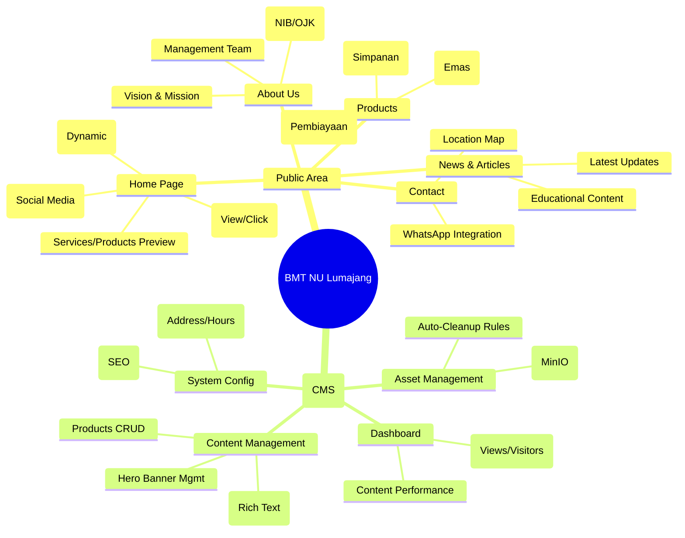
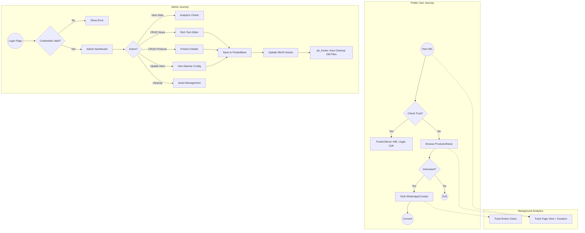
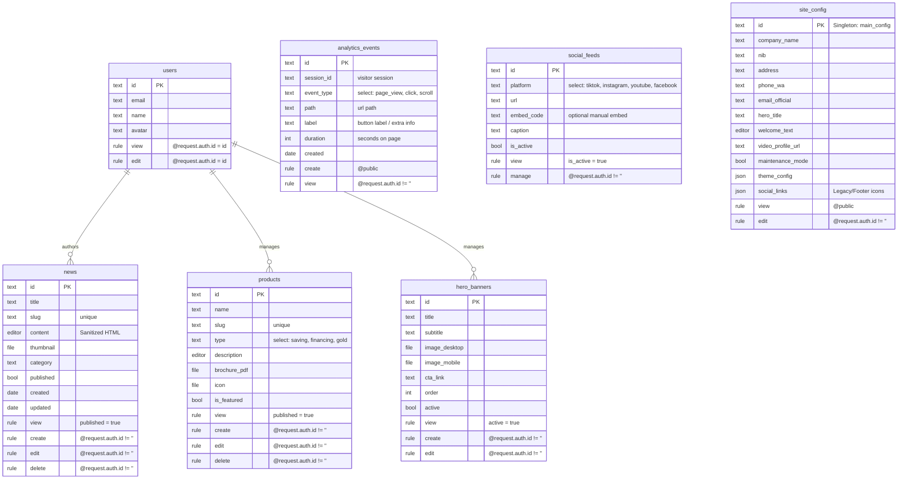

# BMT NU Lumajang - Architecture & Blueprint

**Phase 1: Architecture Design**

This document outlines the technical and security architecture for the BMT NU Lumajang platform (Next.js + PocketBase/MinIO).

## 1. Architectural Diagrams

### A. Feature Map (Mindmap)

Breakdown of Public vs. Admin features.



### B. App User Flow (Flowchart)

User journeys for Public Visitors and Admins.



### C. Advanced ERD (PocketBase Schema)

Entity Relationship Diagram with Security Rules annotated.



## 2. Project Structure (Next.js 14)

d:/web-bmtnulumajang/
├── app/
│   ├── home/                  # [Public Domain] <www.bmtnulmj.local> / public routes
│   │   ├── page.tsx           # Landing Page
│   │   ├── berita/            # News
│   │   └── produk/            # Products
│   ├── panel/                 # [Admin Subdomain] cp.bmtnulmj.local / admin routes
│   │   ├── page.tsx           # Redirect -> Login
│   │   ├── login/page.tsx
│   │   └── dashboard/
│   │       ├── layout.tsx     # Admin Sidebar/Shell
│   │       └── ...
│   ├── api/                   # Route Handlers
│   ├── layout.tsx             # Root Layout (Providers)
│   └── globals.css            # Tailwind + CSS Variables
├── components/
│   ├── ui/                    # Atomic (Shadcn-like) - Buttons, Inputs
│   │   ├── button.tsx
│   │   ├── card.tsx
│   │   └── input.tsx
│   ├── layout/                # Structures
│   │   ├── navbar.tsx
│   │   ├── footer.tsx
│   │   └── admin-sidebar.tsx
│   ├── bento/                 # Custom Bento Grid components
│   │   ├── video-card.tsx
│   │   └── social-tile.tsx
│   └── analytics/             # Analytics Components
│       └── AnalyticsTracker.tsx # Client Component
├── lib/
│   ├── pb.ts                  # PocketBase Client Singleton
│   ├── utils.ts               # cn() and formatters
│   ├── security.ts            # CSP, Sanitization
│   └── analytics.ts           # Analytics helper functions
├── middleware.ts              # Security Middleware (CSP, Bot Block, Rate Limit)
├── pb_hooks/                  # Backend Scripts (MinIO Cleanup)
│   └── main.pb.js
├── public/                    # Static Assets
└── types/                     # TypeScript Interfaces

```

### DRY Strategy

1. **Atomic Design**: Small, dumb components (`components/ui`) like buttons and cards are reused purely for styling. Logic is kept in feature components.
2. **Layout Wrappers**: Admin and Public layouts share no state but may share UI tokens (colors, fonts) via `globals.css`.
3. **Typed Client**: A single `lib/pb.ts` exports a typed PocketBase client, ensuring we don't repeat API rule logic.
4. **Reusable Hooks**: Custom hooks for fetching data (e.g., `useNews`, `useConfig`) to abstract SWR/React Query logic.

## 3. Technical Strategy Specifications

### Analytics Engine (New)

* **Privacy First**: No cookies, just session IDs and anonymous telemetry.
* **Mechanism**:
  * `useAnalytics` Hook: Listens to route changes (Pathname).
  * **Page Views**: Triggered on mount. Records `path`, `ua`, `referrer`.
  * **Time on Page**: Calculated on unmount (`Date.now() - startTime`).
  * **Clicks**: Global listener for `data-track` attributes or generic link clicks.
* **Storage**: `analytics_events` collection in PocketBase. High-performance, simple append-only log.

### MinIO Strict Cleanup (pb_hooks)

To prevent "orphan files" in MinIO:

* We use **PocketBase Hooks** (`main.pb.js`) listening to `onRecordUpdate` and `onRecordDelete`.
* **Logic**:
    1. When a record is updated, check if the old filename != new filename.
    2. If changed, trigger `$filesystem.fileFromPath` deletion for the old file.
    3. When a record is deleted, delete all associated files.

### Meta Verification (Single Source of Truth)

* **Database**: A single collection `meta_config` with a known ID (e.g., `main_config`).
* **Frontend**: The `RootLayout` fetches this data **once** at build time (or revalidated every hour).
* **Context**: Pass data to `Footer`, `Navbar`, and `Metadata` API generation. This ensures if the phone number changes in Admin, it updates everywhere (Header, Footer, Contact Page).

### Dynamic Bento Grid

* **Component**: `components/bento/BentoGrid.tsx`.
* **Detection**:
  * Iterate through `social_feeds` collection.
  * Regex check on URL:
    * `tiktok.com` -> Render `<TikTokEmbed />`
    * `youtube.com` -> Render `<YouTubeLite />` (facade for performance).
    * Default -> Render generic link card.
* **Security**: All iframes strictly sandboxed in `CSP`.

### SEO/Schema (JSON-LD)

We will implement **Structured Data** for rich results:

1. **Organization**: For Home (Logo, Contact, Socials).
2. **FinancialProduct**: For Products (Interest rate, fees - if applicable, or generic Product).
3. **NewsArticle**: For Blog posts (Headline, Image, Date).
4. **BreadcrumbList**: For navigation hierarchy.

## 4. UI/UX Style Guide

### Text & Tone

* **Language**: Bahasa Indonesia (Formal, EYD).
* **Tone**:
  * *Trustworthy (Amanah)*: "Keamanan dana Anda adalah prioritas kami."
  * *Professional (Profesional)*: "Layanan keuangan modern berbasis syariah."
  * *Islamic (Islami)*: Use terms like "Akad Wadiah", "Mudharabah" correctly but explained simply.

### Visual Direction

* **Palette**:
  * Primary: Deep Emerald Green (NU Identity, Trust).
  * Secondary: Gold/Mustard (Prosperity).
  * Neutral: Slate/Gray (Cleanliness).
* **Typography**:
  * Headings: `Inter` or `Plus Jakarta Sans` (Modern, geometric).
  * Body: `Inter` (Readable).
* **Imagery**:
  * High-quality photos of local activities, office front, and smiling staff.
  * Abstract patterns for "Sharia" moifs (geometric islamic patterns) used subtly in backgrounds.

## 7. Sistem Desain & Identitas Brand (Detail)

Untuk menjaga konsistensi visual yang premium dan mencerminkan identitas BMT NU yang terpercaya namun modern, berikut adalah panduan detil penggunaan warna dan gaya:

### A. Palet Warna (Color Palette)

1. **Primary Green (Hijau BMT NU)**:
    * **Kode**: `#15803d` (Tailwind: `green-700`)
    * **Filosofi**: Melambangkan pertumbuhan, stabilitas, dan identitas Nahdlatul Ulama.
    * **Penggunaan**: Navbar, Tombol Utama (Primary Button), Heading Text, Border Aksen.

2. **Secondary Gold (Kuning Emas)**:
    * **Kode**: `#FEF08A` (Tailwind: `yellow-200`) ke `#FACC15` (Tailwind: `yellow-400`)
    * **Filosofi**: Kemakmuran, kejayaan, dan optimisme.
    * **Penggunaan**: Highlight teks penting, Background badge "Promo", Icon aksen, Garis bawah dekoratif.

3. **Neutral Surface (Putih & Abu)**:
    * **White**: `#FFFFFF` (Card Background, Content Area)
    * **Soft Gray**: `#F8FAFC` (Tailwind: `slate-50` - Background Section selang-seling)
    * **Text Dark**: `#1E293B` (Tailwind: `slate-800` - Teks Bacaan Utama)
    * **Text Muted**: `#64748B` (Tailwind: `slate-500` - Keterangan/Sub-text)

### B. Penerapan Gradasi (Gradient Application)

Penggunaan gradasi memberikan kesan modern dan tidak kaku (flat).

1. **Hero Section & Header**:
    * **Style**: Diagonal Gradient
    * **CSS**: `bg-gradient-to-br from-[#15803d] to-[#14532d]` (Hijau Terang ke Hijau Gelap)
    * **Efek**: Memberikan kedalaman pada area judul utama agar teks putih tebal terlihat kontras dan elegan.

2. **Call-to-Action (CTA) Button**:
    * **Normal**: Solid Green `#15803d` dengan shadow halus.
    * **Hover State**: `bg-gradient-to-r from-green-600 to-green-700` + Scale Up.
    * **Special Button (e.g. "Daftar Sekarang")**: Gold Gradient `bg-gradient-to-r from-yellow-400 to-yellow-500` text-green-900 (untuk kontras maksimal).

3. **Card Interactive (Layanan/Produk)**:
    * Saat di-hover, border bawah atau icon berubah menjadi gradasi hijau-emas untuk memberi feedback visual yang halus.

### C. Tipografi & Komponen UI

* **Font Family**: `Inter` atau `Plus Jakarta Sans`. Memberikan kesan modern, bersih, dan sangat mudah dibaca di HP (Mobile First).
* **Rounded Corners**:
  * **Cards**: `rounded-2xl` (Sudut membulat modern).
  * **Buttons**: `rounded-full` (Lebih ramah dan "clickable").
* **Shadows**: Gunakan `shadow-lg` yang lembut (`shadow-green-900/5`) untuk elemen yang melayang di atas background putih.
