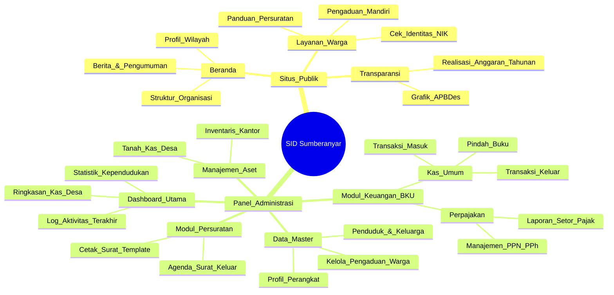
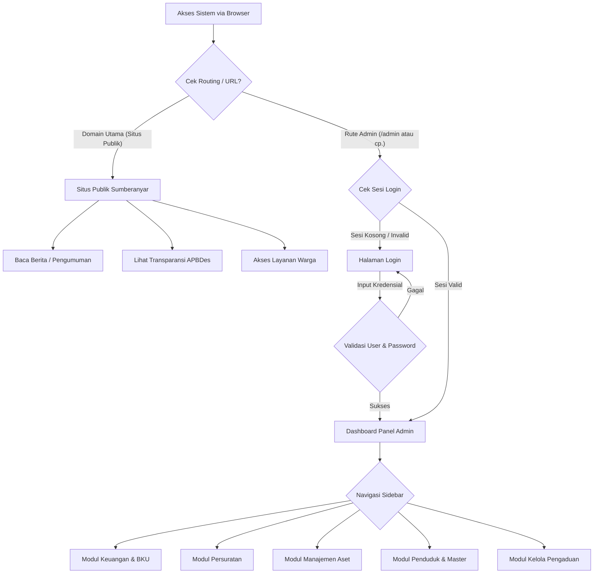
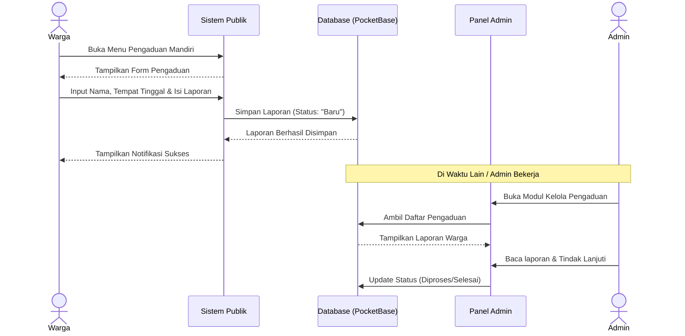
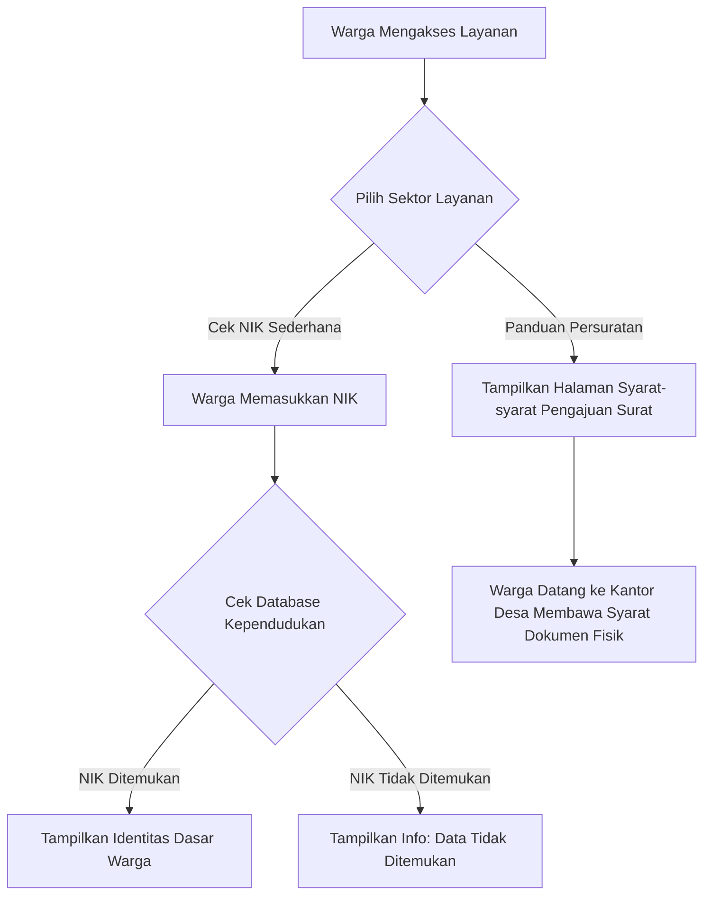
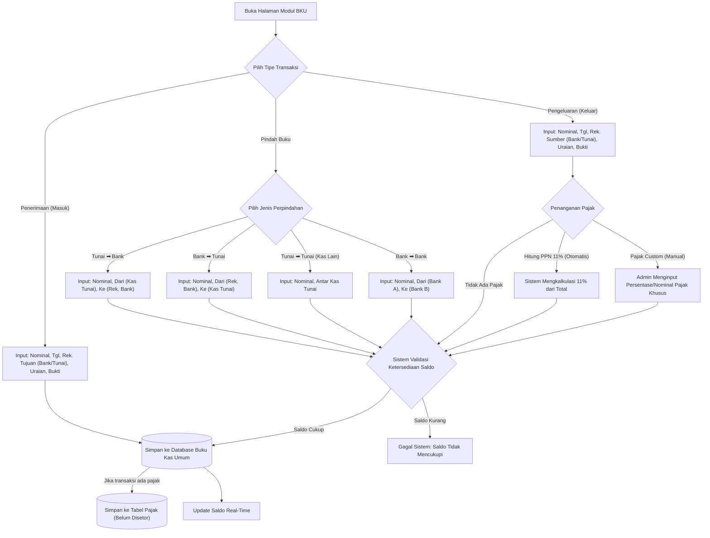
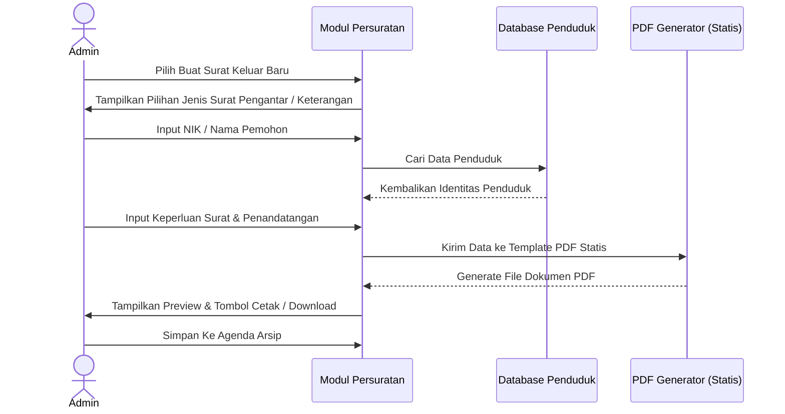
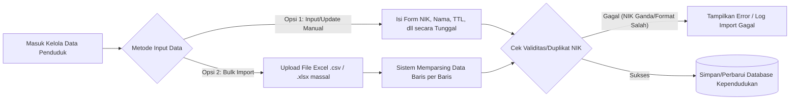
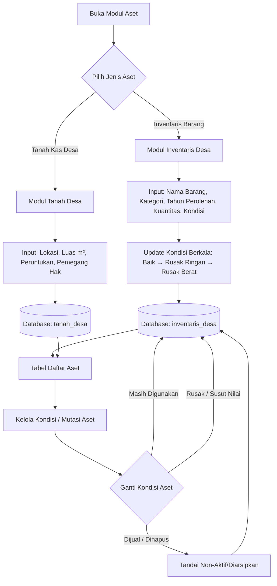

# Rincian Diagram & Alur Logika Aplikasi - SID Sumberanyar

Dokumen ini berisi rincian diagram menggunakan sintaks Mermaid untuk mendokumentasikan semua alur logika, proses bisnis, modul, dan arsitektur dari Sistem Informasi Desa (SID) Sumberanyar.

---

## 1. Peta Situs & Modul (Site Map)

Berikut adalah struktur halaman dan fungsionalitas utama yang membagi sistem menjadi area Publik (Frontend) dan area Administratif (Backend/Dashboard).



---

## 2. Alur Navigasi Utama (Top-Level Flow)

Diagram ini menunjukkan bagaimana user (publik maupun admin) berinteraksi masuk ke dalam sistem sesuai hak akses.



---

## 3. Rincian Alur Modul Publik & Layanan Warga

### A. Alur Pengaduan Mandiri (Publik ke Admin)

Warga dapat melaporkan masalah tanpa login rumit (hanya nama dan tempat tinggal), dan laporan tersebut dikelola oleh admin.



### B. Cek NIK dan Bantuan Persuratan

Alur warga untuk mengecek validitas data mereka dan melihat panduan membuat dokumen surat pengantar di desa.



### C. Alur Transparansi APBDes

Transparansi anggaran adalah fitur penting di akhir tahun. Karena kebutuhan administrasi berjenjang, data agregasinya ditarik dari **input manual** (rekapitulasi akhir) oleh Admin agar data publik terkurasi dan tervalidasi sebelum dipajang.

```mermaid
graph LR
    Admin[Admin Keuangan] --> |Membuat Rekap APBDes Tahunan| FormAPBDes[Input Data Transparansi (Alokasi & Realisasi)]
    FormAPBDes --> DbAPBDes[(Tabel apbdes_realisasi)]

    Warga Publik --> |Buka Menu Transparansi| PublikGrafik[Tampilan View Grafik & Laporan Publik]
    DbAPBDes --> PublikGrafik
```

---

## 4. Rincian Alur Modul Admin

### A. Modul BKU (Buku Kas Umum) & Perpajakan

Sistem ini menangani seluruh alur keuangan harian, perpindahan uang tunai dan rekening bank, hingga perhitungan pajak (otomatis dan kustom).



### B. Modul Persuratan (Admin)

Memfasilitasi pembuatan permohonan/pengantar tertulis untuk internal dan warga. Menggunakan template statis dari kode yang di-_pass_ data dinamisnya untuk cetak.



### C. Modul Data Penduduk (Master Data)

Alur dua arah untuk populasi data penduduk.



### D. Manajemen Aset Desa (Tanah & Inventaris)

Mengelola aset yang dimiliki desa melalui **2 modul terpisah** untuk presisi data:



**Catatan Arsitektur:**

Sistem menggunakan **2 collection terpisah** (`inventaris_desa` dan `tanah_desa`) bukan collection umum `aset_desa` karena:

1. **Field Spesifik Berbeda:**
   - Inventaris: `tahun_perolehan`, `kuantitas`, `kondisi`
   - Tanah: `luas_m2`, `peruntukan`, `pemegang_hak`, `lokasi`

2. **Validasi Lebih Ketat:**
   - Inventaris: Kategori barang (Elektronik, Mebel, Kendaraan, dll)
   - Tanah: Luas dalam m², peruntukan spesifik

3. **Mudah Maintenance:**
   - Update schema independen
   - Query lebih efisien
   - Report terpisah per jenis aset

---

_Dokumen Blueprint Lanjutan._
_Diagram-diagram di atas menggambarkan "Logika Bisnis" (Business Logic) aplikasi secara penuh, mengacu pada model operasional administrasi desa nyata._
