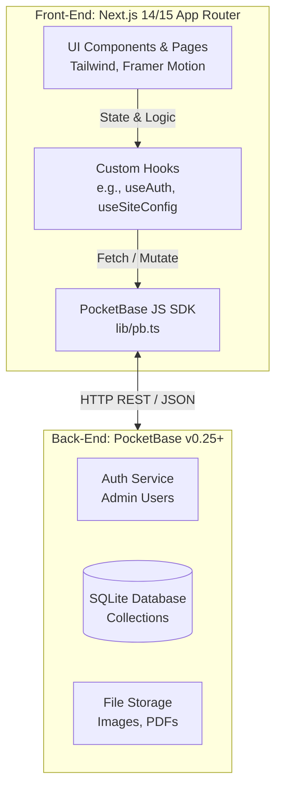
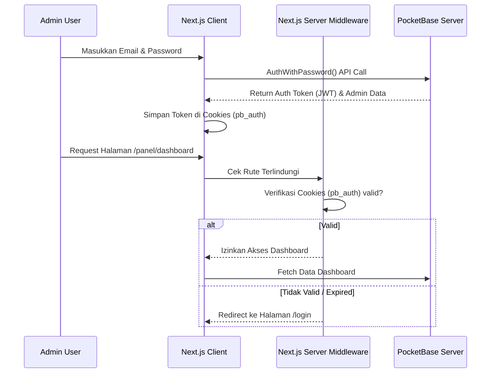
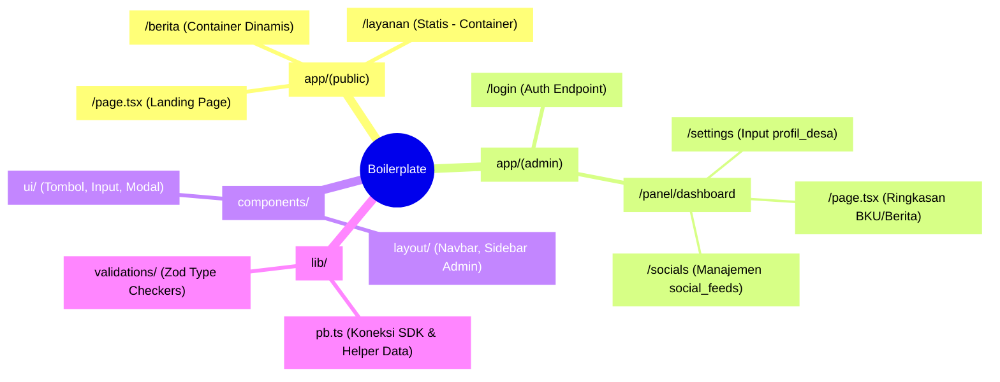

# Dokumentasi Arsitektur Boilerplate SID (Saat Ini)

Dokumen ini menjelaskan rancangan awal (_boilerplate_) aplikasi yang kita miliki **sebelum** penambahan fitur-fitur spesifik Sistem Informasi Desa (SID) Sumberanyar. Merangkap teknologi, _flow_ data, serta inventaris fitur yang sudah siap pakai saat ini.

---

## 1. Arsitektur Level Atas (High-Level Architecture)

Aplikasi ini menggunakan pola **Decoupled Architecture** (Headless), di mana Front-End (Next.js) dan Back-End (PocketBase) terpisah sepenuhnya dan berkomunikasi via REST API/SDK.

---

## 2. Diagram Alur Autentikasi Admin (Siap Pakai)

Sistem sudah memiliki gerbang _login_ yang aman (Terproteksi Middleware) untuk mengunci rute di bawah folder `/app/(admin)`.

---

## 3. Direktori & Fungsionalitas Bawaan (Inventory Boilerplate)

Boilerplate ini sudah dibekali fitur pondasi yang sangat mempercepat pengembangan. Berikut adalah pembagian antara elemen **Dinamis** (dikontrol via _Database_) dan elemen **Statis** (ditulis ke dalam _Codebase_).

### A. Fitur Dinamis (Mengambil data / Mutasi ke Database)

Fitur-fitur di bawah ini sudah menyala dan panel manajemennya bisa digunakan langsung oleh Admin:

1.  **Sistem Autentikasi Otomatis (Dynamic / API)**:
    - _Penjelasan_: Rute `/login` sudah berfungsi murni. Melakukan _cookie-based session_ yang langsung terhubung ke tabel `_superusers` atau `users` PocketBase.
2.  **Konfigurasi Situs / Profil Desa (Dynamic)**:
    - _Route Frontend_: Muncul di Header Navbar, Footer, dan Head Metadata (SEO).
    - _Database_: Membaca dari tabel `profil_desa` (atau `site_config` lama).
    - _Penjelasan_: Logo teks, alamat lengkap kantor desa, nomor WhatsApp, email, dan link sosmed (Instagram/FB) di-_render_ langsung dari database. Admin bisa mengganti nomor WA di panel, dan seluruh website pubik akan langsung berubah tanpa _deploy_ ulang kode.
3.  **Manajemen Feeds Media Sosial / Magic Fetch (Dynamic)**:
    - _Route Frontend_: Komponen _Social Wall_ di Beranda (biasanya ditaruh di `SocialWall.tsx`).
    - _Panel Admin_: Rute pengelola `/panel/dashboard/socials`.
    - _Penjelasan_: Fitur siap pakai untuk menyematkan daftar pos Instagram/TikTok milik kelurahan di beranda publik. Admin memiliki CRUD lengkap untuk menyematkan (Pin) pos penting.

### B. Fitur Statis & Arsitektur Ui (Bawaan Codebase)

Elemen-elemen visual dan utilitas ini merupakan kode solid yang di-_reuse_ berulang kali namun tidak berubah dari backend kecuali di-_coding_ ulang.

1.  **Aturan Desain UI Global (Static)**:
    - Didefinisikan di `app/globals.css` dan `tailwind.config.ts`.
    - _Penjelasan_: Variabel warna `--primary` (Desa Teal) dan `--secondary` (Soil Orange) sudah paten. Kelas CSS bawaan seperti `.btn-primary`, `.badge-secondary`, dan Animasi Skeleton (`animate-pulse`) sudah siap tinggal panggil layaknya library antarmuka profesional.
2.  **Navigasi Utama (Static Layouts)**:
    - Dua layout dasar sudah disiapkan:
      - `app/(public)/layout.tsx`: Layout yang mengunci Navbar Publik di atas dan Footer Publik di bawah secara otomatis pada setiap halaman buat Warga.
      - `app/(admin)/layout.tsx`: Layout khusus dasbor pelayan desa yang menampilkan _Sidebar_ statis di kiri (dengan menu navigasi dasbor) dan Header atas Admin.
3.  **Koleksi Komponen UI / _Primitives_**:
    - Folder `components/ui/` sudah memiliki cetak biru struktur seperti `Button.tsx`, `Modal.tsx`, `Forms.tsx` yang _fully-typed_ dengan TypeScript dan mendukung _Dark Mode_.

---

## 4. Pembagian Wilayah Kerja (Routing Diagram)

Berikut memetakan di mana kode-kode tersebut tersimpan dan tereksekusi pada arsitektur bawaan ini:

## Kesimpulan Kesiapan

Boilerplate ini **SANGAT SIAP** untuk ditumpangi data berat. Alih-alih merancang sistem keamanan dan antarmuka komponen dasar dari nol, kita bisa langsung melompat fokus ke penyelesaian logika bisnis (_Business Logic_) khusus Sistem Informasi Desa, seperti pembuatan tabel CRUD APBDes, generator File Surat/PDF, serta Bulk Import data NIK via Excel.
