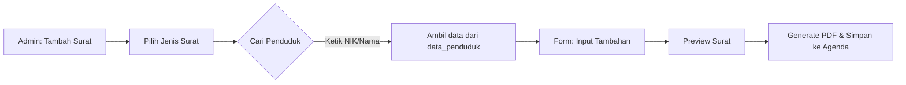

# Draft: Master Data Penduduk & Modul Persuratan Pintar

Dokumen ini merumuskan rencana pengembangan pusat data penduduk dan otomatisasi persuratan untuk SID Sumberanyar.

## 1. Modul Data Master Penduduk

Saat ini kita hanya memiliki data `mutasi_penduduk`. Kita membutuhkan satu sumber kebenaran (Single Source of Truth) untuk seluruh warga desa.

### A. Skema Koleksi `data_penduduk` (PocketBase)

| Field | Tipe | Deskripsi |
|-------|------|-----------|
| `nik` | Text (Unique) | Nomor Induk Kependudukan (16 digit) |
| `nama_lengkap` | Text | Nama sesuai KTP |
| `tempat_lahir` | Text | Kota/Kabupaten lahir |
| `tanggal_lahir` | Date | Tanggal lahir |
| `jenis_kelamin` | Select | Laki-laki / Perempuan |
| `alamat` | Text | Nama Jalan / Dusun |
| `rt` | Text | Nomor RT |
| `rw` | Text | Nomor RW |
| `agama` | Select | Islam, Kristen, dll |
| `status_kawin` | Select | Belum Kawin, Kawin, Cerit Hidup, Cerai Mati |
| `pekerjaan` | Text | Jenis pekerjaan |
| `pendidikan` | Select | SD, SMP, SMA, S1, dll |
| `no_kk` | Text | Nomor Kartu Keluarga |
| `foto_ktp` | File | Arsip digital KTP (Opsional) |

### B. Flow Logika Data
1. **Input Pertama:** Admin mengunggah Excel atau input manual data penduduk.
2. **Koneksi Statistik:** Komponen `Statistik Demografi` di dashboard akan menghitung secara otomatis (`count`) berdasarkan field `jenis_kelamin`, `agama`, dll. dari koleksi ini.
3. **Pencarian Cepat:** Di modul Persuratan, admin cukup mengetik NIK/Nama, dan sistem akan mengambil data dari tabel ini.

---

## 2. Modul Persuratan Pintar (Smart Letter Builder)

User bertanya: *"Jika saya punya file surat pdf kosong, apakah bisa itu dijadikan template?"*
**Jawaban: Bisa.**

### A. Metode Implementasi PDF Template
Ada dua cara utama yang bisa kita gunakan:
1. **PDF Overlay (Posisi Statis):** Kita menggunakan library `pdf-lib`. Sistem akan "menimpa" teks di atas file PDF kosong Anda pada koordinat (X, Y) tertentu. 
   - *Kelebihan:* Persis dengan format asli desa.
   - *Kekurangan:* Sulit jika ada teks yang panjang sekali (perlu bungkus baris/wrap).
2. **Dynamic HTML to PDF:** Kita membuat ulang tampilan surat dengan HTML/CSS agar identik dengan PDF kosong tersebut, lalu di-render menjadi PDF.
   - *Kelebihan:* Sangat fleksibel, teks bisa sepanjang apapun tanpa merusak tata letak.

### B. Flow Logika Pembuatan Surat

## 3. Integrasi & Keamanan

- **Privasi:** Data NIK dan KK adalah data sensitif. Koleksi `data_penduduk` harus memiliki Admin-Only Access (List/View/Update/Delete).
- **Validasi:** Menggunakan Zod untuk memastikan NIK selalu 16 digit dan format tanggal benar.

---

## Rencana Aksi (Next Steps)
1. **Update PocketBase:** Membuat koleksi `data_penduduk` dan `kartu_keluarga`.
2. **Update Sidebar:** Menambahkan menu "Data Induk Penduduk".
3. **Modul Agenda:** Menghubungkan form "Tambah Surat" agar bisa mencari data dari `data_penduduk`.
4. **Template Engine:** Mencoba mengimplementasikan satu template surat (misal: SKTM) menggunakan file PDF kosong sebagai dasarnya.
