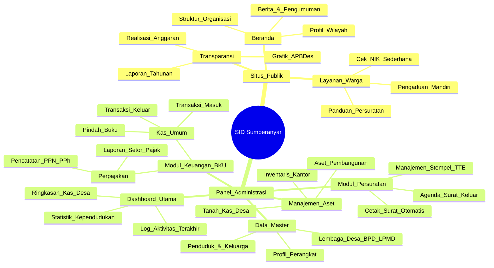
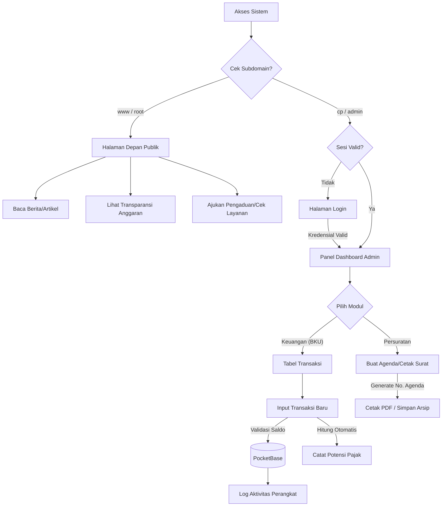
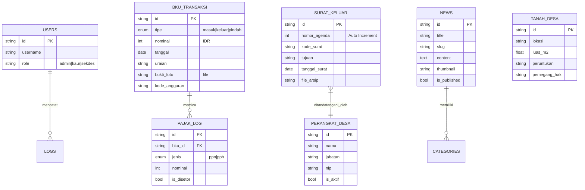

# Arsitektur & Cetak Biru (Blueprint) - SID Sumberanyar

Dokumen ini mendefinisikan struktur, alur kerja, dan spesifikasi teknis untuk pengembangan Sistem Informasi Desa (SID) Sumberanyar.

---

## 1. Diagram Arsitektur

### A. Peta Fitur (Mindmap)

Peta fitur ini mendefinisikan seluruh fungsionalitas utama yang harus tersedia bagi publik maupun perangkat desa (admin).



### B. Alur Pengguna (User Flow)



### C. Skema Database (PocketBase ERD)



---

## 2. Struktur Proyek & Teknis

### A. Organisasi Direktori

```text
app
├── (public)          # Rute Halaman depan (Beranda, Berita, Transparansi)
│   ├── home          # Halaman depan utama
│   ├── berita        # Pengolahan artikel & pengumuman
│   └── layanan       # Panduan warga & pengaduan
├── (admin)           # Rute Panel Kontrol (Panel Admin)
│   ├── panel
│   │   ├── dashboard # Statistik & Ringkasan
│   │   ├── bku       # Pengelolaan Keuangan
│   │   ├── surat     # Pengelolaan Persuratan
│   │   └── aset      # Inventaris & Tanah Desa
│   └── login         # Autentikasi Admin
├── api               # Handler sisi server (jika diperlukan)
└── layout.tsx        # Tata letak utama sistem
```

### B. Strategi Implementasi (DRY & Resilience)

1.  **Validasi Ketat (Zod)**: Semua data dari PocketBase divalidasi menggunakan schema Zod di `lib/validations` sebelum sampai ke komponen UI.
2.  **Akses Terpusat**: Menggunakan `lib/pb.ts` sebagai satu-satunya penyedia klien PocketBase (Singleton).
3.  **Ketahanan Backend (Resilience)**: Komponen prioritas tinggi (Statistik Dashboard) memiliki mekanisme _fallback_ jika koneksi database terganggu.
4.  **SEO Pemerintahan**: Menggunakan standar JSON-LD `GovernmentOrganization` untuk memastikan visibilitas di mesin pencari.

---

## 3. Panduan Gaya & Identitas (UI/UX)

### A. Nada & Bahasa

- **Bahasa**: Indonesia (Formal, Baku, EYD).
- **Nada**: _Amanah_ (Transparan/Jujur) dan _Profesional_ (Efisien dalam Pelayanan).

### B. Palet Warna (Pemerintah)

| Token             | Hex     | Penggunaan                           |
| ----------------- | ------- | ------------------------------------ |
| bg-desa-primary   | #0f766e | Navbar, Tombol Utama, Header Dokumen |
| bg-desa-accent    | #ea580c | Peringatan, Grafik Realisasi, Aset   |
| text-desa-heading | #1e293b | Judul Halaman & Nama Kolom           |
| bg-desa-paper     | #ffffff | Area Teks Surat, Kontainer Berita    |

---

## 4. Strategi Pengujian (Testing)

- **Unit**: Pengujian logika perhitungan pajak dan format mata uang Rupiah.
- **Integrasi**: Alur input BKU hingga pembaruan saldo otomatis.
- **Aksesibilitas (A11y)**: Memastikan tampilan kontras tinggi dan ramah pembaca layar (screen reader) untuk transparansi publik.
