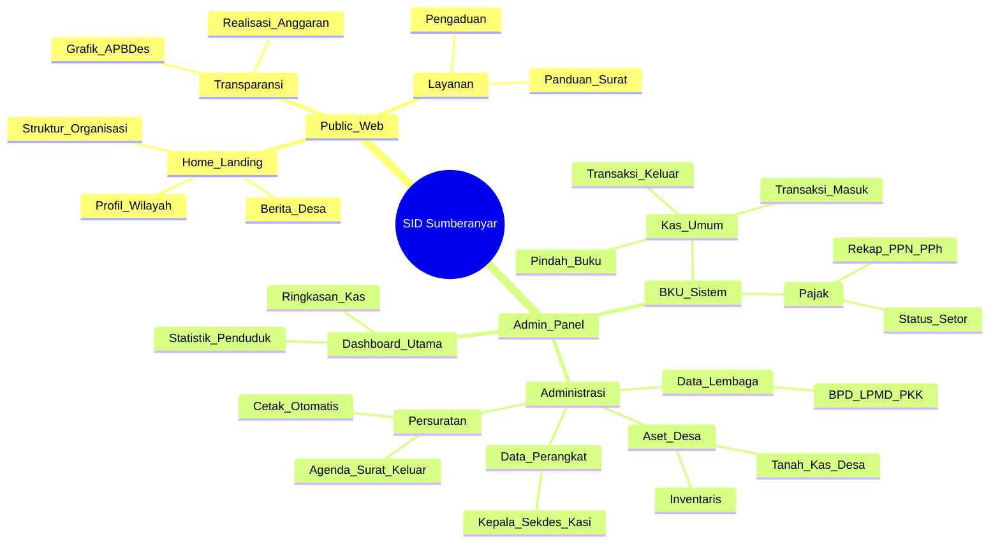
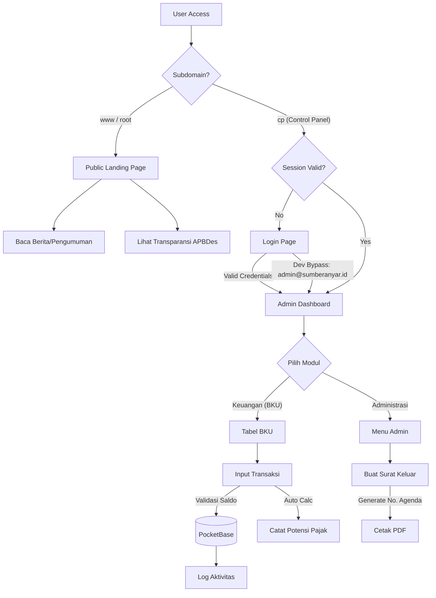
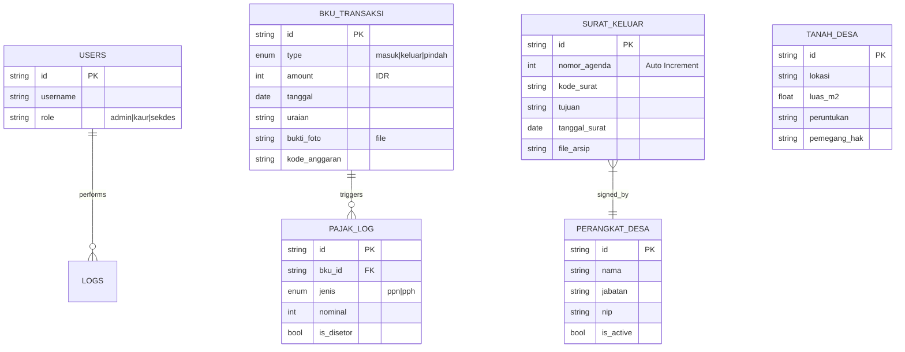

# Architecture & Blueprint - SID Sumberanyar

**Phase 1: Architecture Design**

## 1. Architectural Diagrams

### A. Feature Map (Mindmap)



### B. App User Flow (Flowchart)



### C. Advanced ERD (PocketBase Schema)

### 1. ERD



### 2. Project Structure (Next.js 16)

```bash
d:/coding/nextjs/magang-tes/sid-magang
├── app
│   ├── (public)          # Group Route untuk Web Depan
│   │   ├── home          # Landing Page
│   │   ├── pencarian     # Halaman Pencarian
│   │   └── berita        # Kabar Desa
│   ├── (admin)           # Group Route untuk Panel
│   │   ├── panel
│   │   │   ├── dashboard
│   │   │   ├── bku       # Modul Keuangan
│   │   │   ├── surat     # Modul Persuratan
│   │   │   └── aset      # Modul Tanah/Aset
│   │   └── login
│   ├── api               # Route Handlers (jika butuh proxy)
│   └── layout.tsx        # Root Layout
├── components
│   ├── ui                # Shadcn/Radix Primitives
│   ├── desa-ui           # Custom Village Components (Card Anggaran, Kop Surat)
│   └── layout            # Sidebar, Navbar
├── lib
│   ├── pb.ts             # Typed PocketBase Client (Singleton)
│   ├── utils.ts          # cn(), formatRupiah()
│   └── validations       # Zod Schemas (Strict)
├── middleware.ts         # Subdomain Routing Logic
└── tailwind.config.ts    # Custom Theme 'desa'
```

### 2.1 Configuration & Environment Variables

```env
NEXT_PUBLIC_POCKETBASE_URL="https://db-desa.sumberanyar.id"
NEXT_PUBLIC_DESA_NAME="Sumberanyar"
NEXT_PUBLIC_DESA_ALAMAT="Jl. Raya Sumberanyar No. 1"
# Secret keys for server-side operations
PB_ADMIN_EMAIL="..."
PB_ADMIN_PASS="..."

### 2.2 Resilience & Local Development
1. **Mock Authentication**: In `development` mode, the login page accepts `admin@sumberanyar.id` / `admin123` via a fake JWT bypass to allow testing without a live PocketBase.
2. **Backend Independence**: High-priority components (Hero, Stats, Analytics) use `lib/fallback-data.ts` and internal try-catch blocks to remain functional even if the backend is unreachable.
3. **Zod Validation**: All PocketBase responses are validated at the edge to ensure UI consistency.
```

### DRY Strategy

1. **Atomic Design**: Small, dumb components (`components/ui`) like `tactile-button` and `desa-badge` are reused purely for styling. Logic is kept in feature components.
2. **Layout Wrappers**: Admin and Public layouts share no state but may share UI tokens (colors, fonts) via `globals.css`.
3. **Typed Client**: A single `lib/pb.ts` exports a typed PocketBase client, ensuring we don't repeat API rule logic or validation schemas.
4. **Reusable Hooks**: Custom hooks for fetching data (e.g., `useAnggaran`, `useConfig`) to abstract PocketBase fetching logic and caching.

## 3. Technical Strategy Specifications

### Testing Strategy

- **Framework**: Vitest + React Testing Library (RTL).
- **Scope**:
  - **Unit**: Utility functions (`formatRupiah`, `calculatePajak`).
  - **Component**: UI atoms (`BKUTable`, `BudgetCard`) and molecules.
  - **Integration**: Critical user flows (BKU Transaction Entry -> Saldo Update) with mocked backend.
- **CI/CD**: `pnpm test` must pass before build.

### Analytics Engine (Transparency Focus)

- **Privacy First**: No cookies, just session-based anonymous telemetry focusing on transparency data usage.
- **Mechanism**:
  - `useVisitorCounter` Hook: Simple increment for specific page views (e.g., APBDes page).
  - **Page Views**: Logs access to transparency portals to report citizen engagement.
- **Storage**: `page_stats` collection in PocketBase.

### MinIO Strict Cleanup (pb_hooks)

- We use **PocketBase Hooks** (`main.pb.js`) listening to file updates and record deletions.
- **Logic**:
  1. If evidence photo in BKU is updated, old file is purged from storage.
  2. If a letter (surat) record is deleted, its PDF archive is also deleted.

### Meta Verification (Single Source of Truth)

- **Database**: High-authority `profil_desa` collection (single record).
- **Frontend**: `RootLayout` performs SSG/ISR (24h) for this data.
- **Context**: Ensures village head name, address, and contact info are consistent across footer, letterheads, and SEO meta.

### "AI-Ready" SEO Architecture (High-Resolution Semantics)

1. **Deep Structured Data (JSON-LD)**: Uses `GovernmentOrganization` schema for Google search rich snippets.
2. **Semantic Content Graph**: Links news events to village locations and official entities.
3. **Entity Authority**: OG tags prioritize official village logos and authenticated staff profiles.

## 4. UI/UX Style Guide

### Text & Tone

- **Language**: Bahasa Indonesia (Formal, Baku, EYD).
- **Tone**:
  - _Trustworthy (Amanah)_: Menggunakan istilah yang jelas dan jujur. Data angka disajikan secara transparan tanpa manipulasi visual untuk membangun kepercayaan publik.
  - _Professional (Melayani)_: Komunikasi yang melayani warga dengan efisien, ramah, dan profesional. Interface admin dirancang untuk produktivitas tinggi perangkat desa.

### Visual Direction

- **Palette**:
  - Primary: Desa Teal (#0f766e) - Melambangkan kesuburan, ketenangan, dan stabilitas birokrasi.
  - Secondary: Soil Orange (#ea580c) - Melambangkan kerja keras dan pembangunan infrastruktur desa.
  - Neutral: Slate Grey (#f1f5f9) - Latar belakang bersih untuk dokumen administrasi.
- **Typography**:
  - Headings: Merriweather (Serif) - Memberikan kesan resmi seperti surat dinas pemerintah.
  - Body: Inter (Sans-serif) - Keterbacaan tinggi untuk data tabel BKU dan administrasi.
- **Imagery**:
  - Foto kegiatan desa yang humanis (gotong royong, musyawarah).
  - Icon menggunakan Lucide React dengan stroke tipis agar terlihat elegan dan modern.

## 7. Sistem Desain & Identitas Brand (Detail)

Untuk menjaga wibawa instansi pemerintah desa Balai Desa Sumberanyar, berikut panduannya:

### A. Palet Warna (Color Palette)

| Token Name        | Hex Code | Usage                                   |
| ----------------- | -------- | --------------------------------------- |
| bg-desa-primary   | #0f766e  | Navbar, Tombol Utama, Header Surat      |
| bg-desa-accent    | #ea580c  | Alert Penting, Grafik Realisasi Belanja |
| text-desa-heading | #1e293b  | Judul Halaman, Nama Kolom Tabel         |
| bg-desa-paper     | #ffffff  | Container Surat, Card Berita            |

### B. Penerapan Gradasi (Gradient Application)

1. **Login Page**: Gradasi halus dari Teal 800 ke Teal 600 untuk memberikan kesan kokoh namun modern.
2. **Public Hero**: Overlay gradient hitam transparan (opacity 60%) di atas foto kantor desa untuk memastikan teks judul terbaca jelas.
3. **Dashboard Cards**: Solid color dengan shadow tipis (`shadow-sm`) untuk kenyamanan mata saat input data intensitas tinggi.
